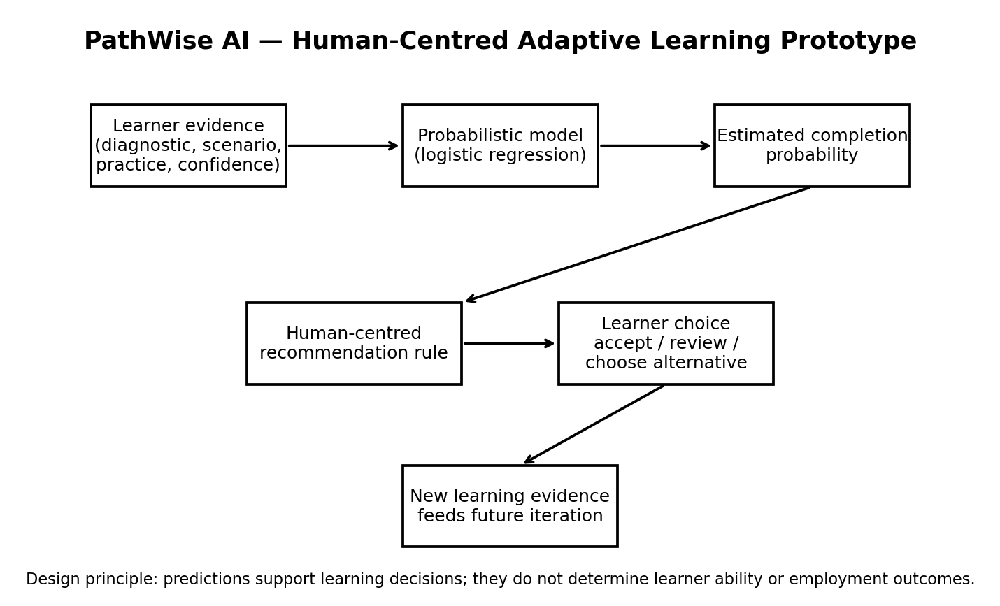
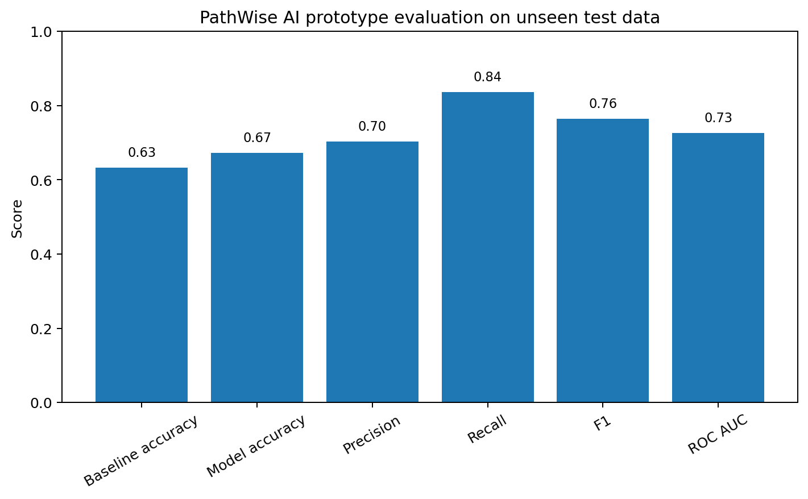

# PathWise AI
### Human-Centred Adaptive Learning for Corporate L&D

**Building AI course project**

## Summary

PathWise AI is an exploratory corporate-L&D prototype that uses synthetic learner data and logistic regression to estimate pathway-completion probability while preserving learner choice, transparency, and human judgement.

PathWise AI asks a simple but important question:

> **How might AI personalise a learner's pathway while preserving learner agency, transparency and human judgement?**

This repository contains a small proof-of-concept built with **synthetic data**. It demonstrates how a probabilistic machine-learning model might support adaptive learning recommendations without turning predictions into fixed labels or automated employment decisions.



## Background

Corporate learning programmes often use one pathway for everyone, even when learners differ in prior knowledge, experience, confidence, performance, and available time. A more adaptive system could potentially use learner evidence to recommend an appropriate starting point or additional support.

However, personalisation can also create problems. A prediction may be inaccurate, poorly calibrated, based on weak proxy variables, or interpreted too strongly. A learner who receives a low predicted probability of completion should not automatically be labelled as low ability, excluded from advanced learning, or evaluated for employment purposes.

PathWise AI therefore treats AI as **decision support for learning**, not as an automated judge.

The prototype focuses on a fictional corporate course called **Responsible AI at Work**.

## How is it used?

A learner completes a diagnostic activity and learning scenarios. The system combines selected evidence such as diagnostic performance, prior AI experience, scenario performance, practice completion, and confidence.

A logistic-regression model estimates the probability that the learner will complete an advanced pathway. The probability is then passed to a **human-centred recommendation layer**.

For example, instead of displaying:

> "Low ability — assign foundation pathway."

the system might display:

> "Recommended starting point: Foundation pathway. This suggestion is based on your current diagnostic and scenario results. You can review why it was suggested, accept it, or choose another pathway."

The intended users are learners and L&D professionals. Managers should not use the prototype for performance management, promotion, recruitment, or other high-stakes employment decisions.

## Data sources and AI methods

### Data

This project uses **1,200 synthetic learner records** generated specifically for this prototype. No real learner, employee, employer, or educational data are used.

Features:

- `diagnostic_score`
- `prior_ai_experience`
- `scenario_performance`
- `practice_completion_pct`
- `confidence_1_to_5`

Target:

- `completed_advanced_pathway`

Because the data are synthetic, the model results demonstrate the workflow rather than real-world predictive validity.

### AI / machine-learning method

The prototype uses **logistic regression** because the target is binary: a learner either completes or does not complete the advanced pathway.

The model outputs a probability between 0 and 1:

`P(completion = 1 | learner evidence)`

A simple majority-class classifier is used as a baseline. The logistic-regression model is then evaluated on an unseen test set using accuracy, precision, recall, F1 score, and ROC AUC.

### Prototype results

The data were split into **900 training cases** and **300 test cases**.

| Metric | Score |
|---|---:|
| Majority-class baseline accuracy | 0.633 |
| Logistic-regression accuracy | 0.673 |
| Precision | 0.704 |
| Recall | 0.837 |
| F1 score | 0.764 |
| ROC AUC | 0.726 |



The notebook also demonstrates how changing the classification threshold changes the balance between precision and recall. This matters because the cost of missing a learner who needs support may differ from the cost of offering unnecessary support.

At a threshold of **0.35**, the prototype produced:

- Accuracy: **0.667**
- Precision: **0.663**
- Recall: **0.963**
- F1: **0.785**

These results should **not** be interpreted as evidence that the system would perform similarly on real learners.

## Challenges

PathWise AI does **not** solve the broader problem of responsible AI in workplace learning. Important limitations include:

- **Synthetic-data limitation:** the prototype has not been validated on real corporate-learning data.
- **Prediction is not causation:** predicting non-completion does not tell us which intervention will improve learning.
- **Construct validity:** features such as confidence or activity completion may not directly measure learning.
- **Data leakage:** features must be available at the actual prediction point; otherwise evaluation can be artificially inflated.
- **Distribution shift:** a model trained on one population, course, organisation, or time period may not generalise to another.
- **Calibration:** a probability such as 0.70 should not be treated as trustworthy unless probability estimates are validated.
- **Class imbalance and metrics:** accuracy alone may hide poor performance on the learners the system is intended to support.
- **Fairness:** errors and model performance should be examined across relevant learner groups and contexts.
- **Privacy and surveillance:** learner data collected for development should not silently become employee-monitoring data.
- **Learner agency:** recommendations should be explainable and contestable, with meaningful alternatives.
- **Human judgement:** AI output should support, not replace, professional L&D judgement in consequential decisions.

## What next?

A future version could:

1. test the concept with a larger, ethically collected dataset and explicit learner consent;
2. compare logistic regression with other interpretable models;
3. evaluate calibration and subgroup performance;
4. conduct learner research to test whether recommendation explanations are understandable and useful;
5. test whether recommended support actually improves learning outcomes rather than merely predicting them;
6. explore NLP for optional learner reflections, with strong privacy and consent safeguards;
7. build a lightweight interface that lets learners review and modify the recommended pathway.

A real-world deployment would require governance, privacy review, human oversight, stakeholder consultation, and validation in the specific organisational context.

## Repository structure

```text
pathwise-ai/
│
├── README.md
├── data/
│   └── synthetic_learners.csv
├── notebooks/
│   └── pathwise_prototype.ipynb
├── images/
│   ├── system_architecture.png
│   └── model_evaluation.png
└── requirements.txt
```

## Acknowledgments

This project was developed as the final project for the **Building AI** course by the University of Helsinki and Reaktor / MinnaLearn.

The prototype uses standard open-source Python libraries including pandas, NumPy, matplotlib, scikit-learn, and Jupyter.

All learner data in this repository are synthetic and were generated specifically for this project. No external datasets, copyrighted images, or third-party code were copied into the project.

---

### Project status

**Exploratory prototype — not for production or high-stakes employment decisions.**
